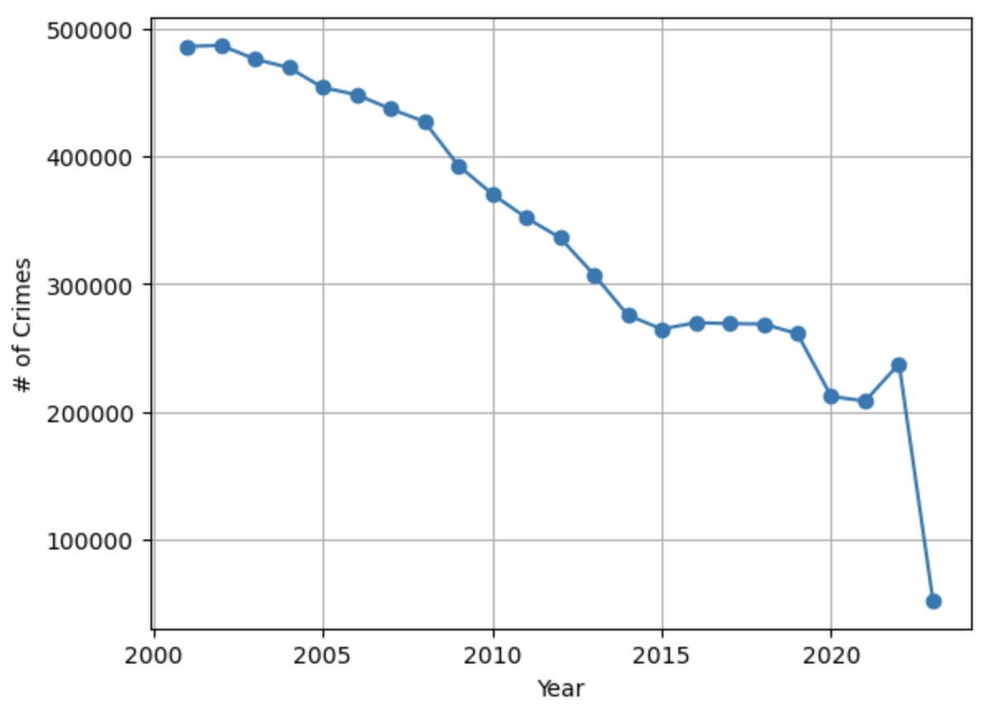
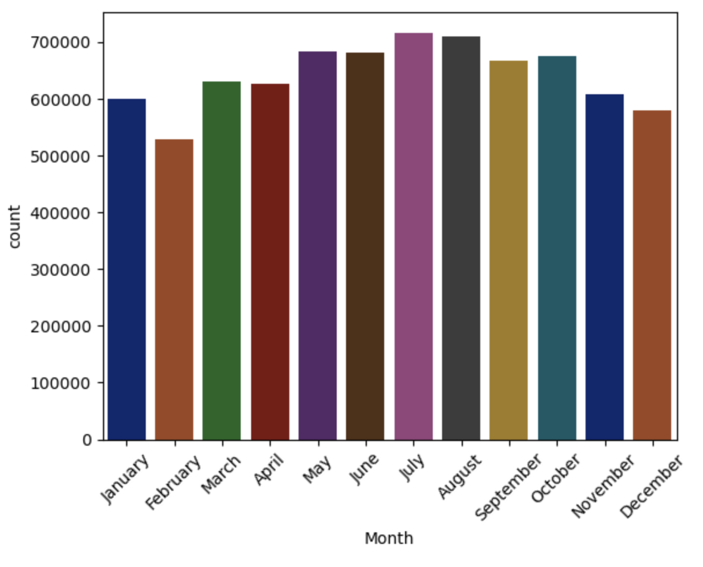

# Chicago Crime Data
 
- Numann Malik

We prepared Chicago crime data into smaller size files by separating years.

Source: https://github.com/coding-dojo-data-science/preparing-chicago-crime-data

## Time Series Analysis

We investigated seasonal trends for different crime statistics. Examples include:

 

## Tableau

Below is a link and screenshot of some data visualization. This included forecasting future crime counts using a line graph and creating a symbol choropleth map for crime locations filtered by month.

Dashboard: https://tabsoft.co/3GKETx0

